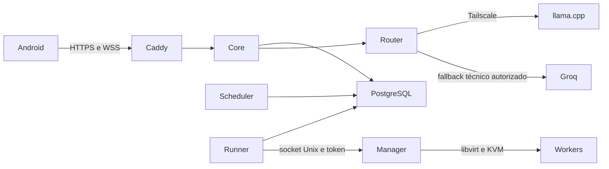

# Arquitetura do DEVLIMA AGENT

Estado da V1 1.0.1, fases 0–9 implementadas. Evidências e limites de homologação em [PHASE_9.md](PHASE_9.md).

## Responsabilidades

Android → HTTPS/WSS → Caddy → Agent Core → PostgreSQL.

O Agent Core valida ações, aplica autorização por usuário, persiste estado e audita operações. A LLM fornece linguagem e ações estruturadas; não é fonte da verdade e não executa shell. PostgreSQL guarda histórico bruto, resumos, memórias, tarefas, agendamentos, eventos e estado dos workers.

O router usa llama.cpp por rede privada, preferencialmente Tailscale. Groq só recebe contexto se `ALLOW_CLOUD_FALLBACK=true` e houver falha técnica permitida. Resposta semanticamente insatisfatória não provoca fallback.

Esse router está implementado na Fase 2: `LLMProvider` → `LlamaCppProvider`/`GroqProvider`, com transporte HTTP compatível e uma única tentativa por provider. Fallback somente por timeout, conexão, 5xx ou erro explícito de modelo indisponível. Erros de autorização/rate limit, JSON inválido e redirects não provocam envio à nuvem. Sem proxy herdado do ambiente e sem seguir redirects.

`llm_requests` registra uma linha por tentativa, correlacionada ao request ID e usuário, com provider/modelo, latência, sucesso/fallback, erro/status e uso de tokens. Não guarda prompts/respostas/chaves; `audit_log` recebe metadados da operação. O recorder faz commit por tentativa; chamadas LLM antecedem transações de execução de ações.

Os endpoints autenticados `/llm/health` e `/llm/chat` permitem validar providers. Esse chat de diagnóstico é stateless. `/chat/messages` passa pelo Agent Core, persiste mensagens, monta contexto e valida propostas. O CLI administrativo permite diagnóstico sem criar usuário padrão ou expor JWT.

Na Fase 3, uma transação salva a mensagem e uma lease durável da conversa antes da inferência. Não há lock ou transação aberta durante HTTP. Ao receber JSON válido, o Core verifica a lease e grava resposta, candidatos, ações e auditoria atomicamente. Chave idempotente por usuário permite replay sem nova inferência. Expiração recupera turnos abandonados; falhas mantêm a mensagem original. Os módulos Context Builder, Summarizer, Memory Manager, parser Pydantic e Action Engine têm responsabilidades separadas, descritas em [CONTEXT.md](../CONTEXT.md).

## Processos e isolamento

- **backend:** FastAPI/SQLAlchemy/Pydantic; container não root, sem acesso ao host, libvirt ou socket Docker.
- **postgres:** volume persistente, rede Docker interna, nenhuma porta publicada.
- **scheduler:** processo separado; APScheduler acorda o processo, e eventos PostgreSQL são reivindicados transacionalmente com lock e identificador idempotente. Agendamentos não dependem de timers em memória.
- **caddy:** TLS, proxy HTTP e WebSocket; dados de certificados persistentes.
- **worker-runner:** reivindica comandos duráveis, consulta resultados idempotentes e reconcilia status real dos workers. Único container com acesso ao socket/token do manager.
- **vm-manager:** serviço root systemd no host, API privada em socket Unix autenticado, operações enumeradas, ownership/paths/quotas validados. Core HTTP não recebe shell no host.
- **workers:** overlays QCOW2 do template existente, cloud-init individual, rede libvirt default NAT.

Android mantém serviço de conexão iniciado pelo usuário e serviço de voz durante chamada atendida. SpeechRecognizer/TTS pertencem ao aparelho; Core mantém call_sessions e a conversa associada. `voice.transcript` usa a mesma fila/contexto/idempotência do chat. Áudio contínuo/WebRTC e engines de voz próprios ficam para evolução futura.

## Dados e evolução

Migrations explícitas versionam o schema até `0007_calls`. Nenhum `create_all` no startup. Usuários/auditoria, inferências, conversas/contexto/memórias, planejamento/outbox, workers/comandos/snapshots, dispositivos/refresh/ACK e chamadas são persistidos. Relações de dados pessoais usam escopo por usuário.

Timestamps em UTC com timezone; preferências do usuário armazenam `America/Sao_Paulo` por padrão. Identificadores UUID. JWT de curta duração; `token_version` permite invalidar sessões ao redefinir senha/desativar usuário.

Histórico bruto é preservado; Context Builder compõe janela limitada, resumo, memórias e estado relevante. Candidatos de memória e ações da LLM passam por schemas/validação antes de persistência. pgvector fica reservado para evolução.

Entrega de lembretes/chamadas usa outbox persistente, ACK por dispositivo e deduplicação por `event_id`. Android grava localmente antes do ACK; mensagens usam UUID estável para replay. Rede e políticas Android não permitem prometer entrega exatamente uma vez ou após force stop: servidor e app toleram reenvios após reconexão.

Banco utiliza identidades separadas de administrador, migrations e runtime. Configuração/keys permanecem fora do Git. Dump PostgreSQL e SQLite consistente do manager são cifrados com AES-256-GCM para cópia externa; discos descartáveis dos workers são excluídos. [Segurança](SECURITY.md) e [recuperação](RECOVERY.md).

## Deploy e recursos

Compose com healthchecks, limites de memória/CPU e restart automático. Migrations executam uma vez antes do backend. A configuração padrão é privada, com Caddy em `127.0.0.1:8443` e `127.0.0.1:8080` para túnel SSH.

Nesta implantação, o domínio fornecido `agent.vegasolucoes.com.br` aponta para o host; Caddy publica 80/443 com certificado público Let’s Encrypt validado externamente. Não foi necessário alterar regras OCI. O modo privado alternativo usa certificado interno, que não é aceito automaticamente pelo Android.

Imagens Python/PostgreSQL/Caddy fixadas por digest e dependências Python por versão exata. Atualizações devem regenerar os pins e executar novamente os testes.

Quotas implementadas: até 2 workers, 4 vCPUs e 8 GiB RAM somados, reserva de pelo menos 4 GiB de RAM/uma CPU/10 GiB de disco para host/core/banco. Recursos livres e domínios externos são considerados antes de alocar. Template de 3,5 GiB usa overlay expansível, por padrão 20 GiB, com growpart/resizefs no guest. BOOTING é distinto de READY; SSH, guest-agent e cloud-init precisam confirmar prontidão antes de executar jobs.

## Referências verificadas

- [Docker no Ubuntu](https://docs.docker.com/engine/install/ubuntu/)
- [Docker e encaminhamento/firewall](https://docs.docker.com/engine/network/packet-filtering-firewalls/)
- [FastAPI em containers](https://fastapi.tiangolo.com/deployment/docker/)
- [HTTPS automático do Caddy](https://caddyserver.com/docs/automatic-https)
